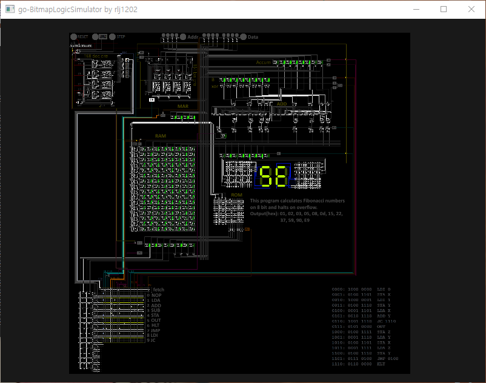

# go-BitmapLogicSimulator

This is an implementation of Bitmap Logic Simulator.
Original article is [https://realhet.wordpress.com/2015/09/02/bitmap-logic-simulator/](https://realhet.wordpress.com/2015/09/02/bitmap-logic-simulator/).

The application is implemented with OpenGL.

## Screenshots


## How does it work?
### Rules
Usage is very simple. Draw circuit in your favorate image editor, and load the image!

The rules are also simple.

```
'.' = dark pixel, insulation
'#' = bright pixel, conductive

'bright' means the value of either red or green or blue is greater than 223. 'dark' is the other color.
So color can be various.
```

```
...........
.#########.
...........
.####......
....######.
...........
some wires
```

```
...........
.....#.....
.....#.....
.####.####.
.....#.....
.....#.....
...........
wire crossing
```

```
...........
....##.....
.####.####.
....##.....
...........
NOT gate (Input is left and output is right. Four directions are possible.)
```

So, there is 5 possible certain components.
AND gate can be constructed like this.

```
..........
..##......
.##.##....
..##.##...
.....#.##.
..##.##...
.##.##....
..##......
..........
AND gate
```

OR gate can be constructed using two wires merged.

```
..........
.#####....
.....####.
.#####....
..........
```

### Simulation

## TODO List
- [x] Simulation
- [x] File refresh per some certain time
- [x] Load and save configuration
- [ ] Optimization(performance, memory)
- [ ] Gate and wire viewr(overlay)
- [ ] User Interface
